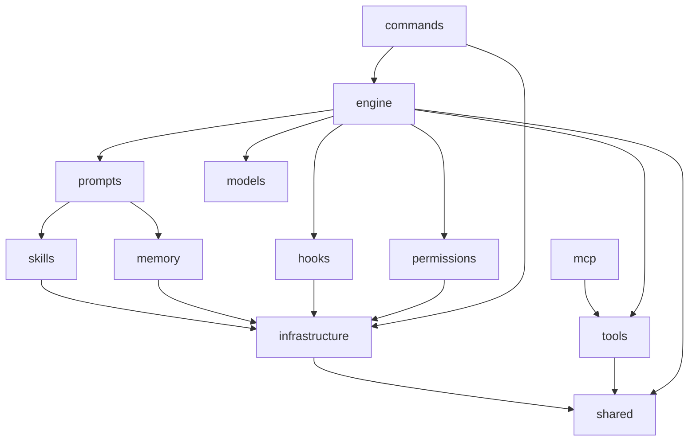

# Rhythm 后端完整重构规划

> 参考基础：OpenHarness 所有架构文档（14 个模块）
> 目标：将当前原型级后端升级为生产级、可扩展的 Agent 引擎
> 策略：**规划完整，分阶段实施**

---

## 一、现状分析

### 当前目录结构

```
src-tauri/src/
├── commands/                    # Tauri IPC 层
│   ├── chat.rs                  # chat_stream / submit_user_answer
│   ├── session.rs               # get_sessions
│   ├── interrupt.rs             # interrupt_session
│   └── mod.rs
├── core/
│   ├── agent_loop.rs            # Agent 主循环（单体，硬编码工具列表）
│   ├── agent_registry.rs        # Agent 注册（基础）
│   ├── event_bus.rs             # 事件总线（emit 到前端）
│   ├── state.rs                 # 全局状态（中断信号 DashMap）
│   ├── models/                  # LLM 客户端（OpenAI + Anthropic）
│   └── tools/                   # 8个工具（平铺，接口耦合）
├── infrastructure/
│   ├── config.rs                # ~/.rhythm/settings.json 加载
│   └── database.rs              # SQLite（会话存储）
└── shared/
    └── schema.rs                # 事件类型 + 共享结构体
```

### 核心问题清单

| 问题 | 风险 |
|------|------|
| 工具硬编码在 `AgentLoop::new` 中 | 加工具需改引擎代码 |
| 工具 [execute](file:///c:/Users/Administrator/Documents/dev/rhythm/src-tauri/src/core/tools/read_file.rs#40-51) 参数中混入 `agent_id/session_id/tool_call_id` | 工具与运行时高度耦合 |
| 无权限控制系统 | 危险操作无任何保护 |
| 无 `max_turns` 保护 | 可能无限循环 |
| 无结构化错误类型 | 错误追踪困难 |
| 无系统提示词组装机制 | 无法注入环境信息、记忆等上下文 |
| 无跨会话记忆 | 每次会话从零开始 |
| 无 Hooks 机制 | 无法审计/拦截工具调用 |
| 无插件/Skills 扩展点 | 能力固化 |
| Subagent 是 mock 实现 | 子 Agent 无法真实运行 |
| 配置结构单薄 | 无法支撑后续功能 |

---

## 二、目标架构（完整）

### 目录结构

```
src-tauri/src/
│
├── commands/               # ① Tauri IPC 层（适配，不含业务逻辑）
│   ├── mod.rs
│   ├── chat.rs             # chat_stream, approve_permission, submit_answer
│   ├── session.rs          # get_sessions, create_session, delete_session
│   ├── memory.rs           # get_memory, add_memory, delete_memory  [后期]
│   └── interrupt.rs        # interrupt_session（保留）
│
├── engine/                 # ② 核心Agent引擎（新建，替换 core/agent_loop.rs）
│   ├── mod.rs
│   ├── query_engine.rs     # QueryEngine：会话级对象，管理 messages 历史
│   ├── agent_loop.rs       # run_query()：核心 tool-call 循环
│   ├── stream_events.rs    # StreamEvent 枚举（统一流式事件类型）
│   └── context.rs          # QueryContext：跨循环共享上下文
│
├── tools/                  # ③ 工具系统（重构）
│   ├── mod.rs              # BaseTool trait + ToolRegistry + ToolResult
│   ├── context.rs          # ToolExecutionContext（cwd, metadata）
│   ├── shell.rs
│   ├── read_file.rs
│   ├── write_file.rs
│   ├── edit_file.rs
│   ├── delete_file.rs
│   ├── ask.rs
│   ├── plan.rs
│   └── subagent.rs         # 真实子 Agent 派生（后期）
│
├── permissions/            # ④ 权限系统（新建）
│   ├── mod.rs
│   ├── modes.rs            # PermissionMode 枚举
│   └── checker.rs          # PermissionChecker + PermissionDecision
│
├── prompts/                # ⑤ 系统提示词引擎（新建）
│   ├── mod.rs
│   ├── builder.rs          # build_system_prompt() + build_runtime_prompt()
│   ├── environment.rs      # 运行环境信息采集（OS, Shell, Git, cwd）
│   └── rhythm_md.rs        # RHYTHM.md 项目指令文件加载（类 CLAUDE.md）
│
├── memory/                 # ⑥ 跨会话记忆系统（新建）
│   ├── mod.rs
│   ├── types.rs            # MemoryHeader 数据类型
│   ├── paths.rs            # 路径计算（SHA1 项目哈希隔离）
│   ├── manager.rs          # add / remove / scan / list 操作
│   └── search.rs           # 启发式关键词相关性搜索
│
├── hooks/                  # ⑦ 生命周期钩子系统（新建）
│   ├── mod.rs
│   ├── events.rs           # HookEvent 枚举（session_start/end, pre/post_tool_use）
│   ├── types.rs            # HookResult + AggregatedHookResult
│   ├── schemas.rs          # HookDefinition（Command/Http 两种，Rust 场景）
│   ├── registry.rs         # HookRegistry
│   └── executor.rs         # HookExecutor：异步执行，fnmatch 匹配，结果聚合
│
├── skills/                 # ⑧ Skills 技能系统（新建）
│   ├── mod.rs
│   ├── types.rs            # SkillDefinition（name, description, content, source）
│   ├── registry.rs         # SkillRegistry
│   └── loader.rs           # 内置 + 用户（~/.rhythm/skills/）加载
│
├── mcp/                    # ⑨ MCP 协议接入（新建）[后期]
│   ├── mod.rs
│   ├── types.rs            # McpServerConfig（Stdio/Http/Ws）
│   ├── client.rs           # McpClientManager：连接管理、工具发现
│   └── adapter.rs          # McpToolAdapter → BaseTool
│
├── models/                 # ⑩ LLM 客户端（微调，保留）
│   ├── mod.rs
│   ├── anthropic.rs
│   └── openai.rs
│
├── infrastructure/         # ⑪ 基础设施（扩展）
│   ├── mod.rs
│   ├── config.rs           # 扩展配置结构（含权限、记忆、hooks、MCP）
│   ├── paths.rs            # 路径管理（~/.rhythm/...）[新建]
│   └── database.rs         # SQLite（会话存储，保留）
│
├── shared/                 # ⑫ 共享类型（扩展）
│   ├── mod.rs
│   ├── schema.rs           # 事件类型（扩展）
│   └── error.rs            # 统一错误类型 RhythmError [新建]
│
└── lib.rs                  # 入口，注册 Tauri 命令
```

---

## 三、各模块详细设计

### ① commands/（核心机制）

```rust
// Tauri 命令层只做薄适配，不含业务逻辑

// chat.rs
#[tauri::command] chat_stream(session_id, prompt, cwd, ...)
#[tauri::command] approve_permission(session_id, tool_id, approved: bool)
#[tauri::command] submit_user_answer(session_id, tool_id, answer: String)
#[tauri::command] interrupt_session(session_id)

// session.rs
#[tauri::command] get_sessions() -> Vec<SessionSummary>
#[tauri::command] create_session(title) -> SessionSummary
#[tauri::command] delete_session(session_id)

// memory.rs [后期]
#[tauri::command] list_memories(cwd)
#[tauri::command] add_memory(cwd, title, content)
#[tauri::command] delete_memory(cwd, name)
```

### ② engine/（Agent 引擎核心）

参照 OpenHarness `engine/` 设计：

```rust
// context.rs - 跨循环共享上下文（Query 级别）
pub struct QueryContext {
    pub api_client: Arc<dyn LlmClient>,
    pub tool_registry: Arc<ToolRegistry>,
    pub permission_checker: Arc<PermissionChecker>,
    pub hook_executor: Option<Arc<HookExecutor>>,    // [hooks 阶段引入]
    pub cwd: PathBuf,
    pub model: String,
    pub system_prompt: String,
    pub max_turns: usize,              // 默认 100，防止无限循环
    pub agent_id: String,
    pub session_id: String,
}

// query_engine.rs - 会话级对象，管理 messages 历史
pub struct QueryEngine {
    context: QueryContext,
    messages: Vec<ChatMessage>,
    usage_tracker: UsageTracker,       // 累积 token 用量
}
impl QueryEngine {
    pub fn new(context: QueryContext) -> Self
    pub async fn submit_message(&mut self, prompt: String) -> Result<(), RhythmError>
    pub fn set_system_prompt(&mut self, prompt: String)
    pub fn clear(&mut self)            // 清空历史（新会话）
    pub fn messages(&self) -> &[ChatMessage]
    pub fn total_usage(&self) -> &UsageSnapshot
}

// stream_events.rs - 统一流式事件枚举（对应 shared/schema.rs 中 EventPayload）
pub enum StreamEvent {
    ThinkingDelta { content: String },
    ThinkingEnd { time_cost_ms: u64 },
    TextDelta { content: String },
    ToolStart { tool_id: String, tool_name: String, args: Value },
    ToolEnd { tool_id: String, exit_code: i32 },
    PermissionRequest { tool_id: String, tool_name: String, reason: String },
    AskUser { tool_id: String, question: String },
    Done { usage: UsageSnapshot },
    Interrupted,
    Error { message: String },
    MaxTurnsExceeded { turns: usize },
}

// agent_loop.rs - 核心 tool-call 循环
pub async fn run_query(
    context: &QueryContext,
    messages: &mut Vec<ChatMessage>,
    usage: &mut UsageTracker,
) -> Result<(), RhythmError> {
    for turn in 0..context.max_turns {
        // 1. 调用 LLM（流式）
        // 2. 流式 emit TextDelta / ThinkingDelta 事件
        // 3. 解析 ToolCall，收集 pending_tool_calls
        // 4. 无 tool_calls → break（完成）
        // 5. execute_tools()（含 Hook + 权限检查）
        // 6. 将结果追加到 messages，继续循环
    }
    // 超过 max_turns → emit MaxTurnsExceeded
}
```

### ③ tools/（工具系统）

```rust
// mod.rs - 核心 Trait + 注册表 + 结果类型
#[async_trait]
pub trait BaseTool: Send + Sync {
    fn name(&self) -> &'static str;
    fn description(&self) -> &'static str;
    fn parameters(&self) -> Value;           // JSON Schema
    fn is_read_only(&self) -> bool { false } // 供权限系统使用
    
    async fn execute(
        &self,
        args: Value,
        ctx: &ToolExecutionContext,          // 不再含 agent_id/session_id
    ) -> ToolResult;
}

pub struct ToolResult {
    pub output: String,
    pub is_error: bool,
}

pub struct ToolRegistry {
    tools: HashMap<String, Box<dyn BaseTool>>,
}
impl ToolRegistry {
    pub fn register(&mut self, tool: Box<dyn BaseTool>)
    pub fn get(&self, name: &str) -> Option<&dyn BaseTool>
    pub fn to_api_schema(&self) -> Vec<LlmToolDefinition>
    pub fn create_default() -> Self       // 注册所有内置工具
}

// context.rs - 工具执行上下文
pub struct ToolExecutionContext {
    pub cwd: PathBuf,
    pub agent_id: String,
    pub session_id: String,
    pub tool_call_id: String,
    pub metadata: HashMap<String, Value>,  // 可注入 skill_registry、mcp_manager 等
}
```

### ④ permissions/（权限系统）

参照 OpenHarness `permissions/` 精确实现：

```rust
// modes.rs
pub enum PermissionMode {
    Default,    // 只读允许，写操作发 PermissionRequest → 前端确认
    Plan,       // 阻止所有写操作（只读分析模式）
    FullAuto,   // 允许所有操作（自动化模式）
}

// checker.rs
pub struct PermissionDecision {
    pub allowed: bool,
    pub requires_confirmation: bool,
    pub reason: String,
}

pub struct PermissionChecker {
    mode: PermissionMode,
    allowed_tools: Vec<String>,     // 显式白名单
    denied_tools: Vec<String>,      // 显式黑名单
    path_rules: Vec<PathRule>,      // Glob 路径规则 [后期]
    denied_commands: Vec<String>,   // 命令模式拒绝 [后期]
}

impl PermissionChecker {
    // 评估优先级：黑名单 > 白名单 > 路径规则 > FULL_AUTO > 只读放行 > PLAN拒绝 > DEFAULT需确认
    pub fn evaluate(&self, tool_name: &str, is_read_only: bool) -> PermissionDecision
}
```

**与 AgentLoop 集成流程：**
```
execute_tool() {
    1. [hook] pre_tool_use → blocked? → 返回错误 ToolResult
    2. permission_checker.evaluate()
       - allowed=true → 执行
       - requires_confirmation=true → emit PermissionRequest → 挂起等待前端
       - allowed=false → 返回错误 ToolResult
    3. tool.execute()
    4. [hook] post_tool_use
}
```

### ⑤ prompts/（系统提示词引擎）

参照 OpenHarness `prompts/` 实现，Rust 版本：

```rust
// builder.rs
pub struct PromptBuilder;
impl PromptBuilder {
    /// 组装运行时系统提示词（7层结构）
    pub fn build_runtime_prompt(
        settings: &RhythmSettings,
        cwd: &Path,
        latest_user_prompt: Option<&str>,
    ) -> String {
        // Layer 1: 基础角色提示词（Rhythm AI Coding Assistant）
        // Layer 2: 环境信息（OS, Shell, cwd, Git 状态, 日期）
        // Layer 3: Skill 列表（可用 Skills 名称+描述）
        // Layer 4: RHYTHM.md 项目指令文件
        // Layer 5: 记忆系统（MEMORY.md 索引 + 相关记忆）[记忆阶段引入]
        // Layer 6: 用户自定义系统提示词（settings.system_prompt）
        // Layer 7: 权限/行为模式说明
    }
}

// environment.rs
pub struct EnvironmentInfo {
    pub os_name: String,
    pub os_version: String,
    pub shell: String,
    pub cwd: String,
    pub date: String,
    pub is_git_repo: bool,
    pub git_branch: Option<String>,
    pub hostname: String,
}

// rhythm_md.rs
/// 从 cwd 向上遍历，发现并加载 RHYTHM.md 文件（类 CLAUDE.md）
pub fn load_rhythm_md(cwd: &Path) -> Option<String>
```

### ⑥ memory/（跨会话记忆系统）

参照 OpenHarness `memory/` 实现：

```rust
// types.rs
pub struct MemoryHeader {
    pub path: PathBuf,
    pub title: String,
    pub description: String,
    pub modified_at: f64,         // 时间戳（排序用）
    pub memory_type: String,
    pub body_preview: String,     // 前 300 字符
}

// paths.rs
/// ~/.rhythm/data/memory/{project-name}-{sha1[:12]}/
pub fn get_project_memory_dir(cwd: &Path) -> PathBuf
pub fn get_memory_entrypoint(cwd: &Path) -> PathBuf  // MEMORY.md

// manager.rs
pub fn add_memory(cwd: &Path, title: &str, content: &str) -> Result<PathBuf>
pub fn remove_memory(cwd: &Path, name: &str) -> bool
pub fn list_memory_files(cwd: &Path) -> Vec<PathBuf>
pub fn scan_memory_files(cwd: &Path, max_files: usize) -> Vec<MemoryHeader>

// search.rs
/// 启发式词频匹配，元数据权重 2x，正文权重 1x
pub fn find_relevant_memories(
    query: &str, cwd: &Path, max_results: usize
) -> Vec<MemoryHeader>
```

**存储结构：**
```
~/.rhythm/data/memory/
└── rhythm-a1b2c3d4e5f6/    # {项目名}-{SHA1 前12位}
    ├── MEMORY.md             # 索引文件
    ├── api_design.md
    └── user_prefs.md
```

### ⑦ hooks/（钩子系统）

参照 OpenHarness `hooks/` 实现（Rust 版，仅保留 Command 和 Http 类型）：

```rust
// events.rs
pub enum HookEvent {
    SessionStart,
    SessionEnd,
    PreToolUse,
    PostToolUse,
}

// schemas.rs（Rust 版仅两种类型，去掉 Prompt/Agent Hook）
pub enum HookDefinition {
    Command(CommandHook),    // 执行 shell 命令
    Http(HttpHook),          // POST 到 HTTP 端点
}
pub struct CommandHook {
    pub command: String,
    pub timeout_secs: u64,
    pub matcher: Option<String>,   // fnmatch 模式匹配 tool_name    
    pub block_on_failure: bool,
}
pub struct HttpHook {
    pub url: String,
    pub headers: HashMap<String, String>,
    pub timeout_secs: u64,
    pub matcher: Option<String>,
    pub block_on_failure: bool,
}

// types.rs
pub struct HookResult {
    pub success: bool,
    pub blocked: bool,
    pub reason: String,
}
pub struct AggregatedHookResult {
    pub results: Vec<HookResult>,
}
impl AggregatedHookResult {
    pub fn blocked(&self) -> bool { self.results.iter().any(|r| r.blocked) }
    pub fn reason(&self) -> &str { /* 第一个 blocked 的 reason */ }
}

// executor.rs
pub struct HookExecutor {
    registry: HookRegistry,
}
impl HookExecutor {
    pub async fn execute(
        &self,
        event: HookEvent,
        payload: &Value,   // { tool_name, tool_input, ... }
    ) -> AggregatedHookResult
}
```

### ⑧ skills/（Skills 技能系统）

参照 OpenHarness `skills/` 实现：

```rust
// types.rs
pub struct SkillDefinition {
    pub name: String,
    pub description: String,
    pub content: String,           // Markdown 原始内容
    pub source: SkillSource,       // Bundled | User
}
pub enum SkillSource { Bundled, User }

// registry.rs
pub struct SkillRegistry {
    skills: HashMap<String, SkillDefinition>,
}
impl SkillRegistry {
    pub fn register(&mut self, skill: SkillDefinition)
    pub fn get(&self, name: &str) -> Option<&SkillDefinition>
    pub fn list_skills(&self) -> Vec<&SkillDefinition>
}

// loader.rs
/// 加载顺序：内置（嵌入二进制）→ 用户（~/.rhythm/skills/*.md）
pub fn load_skill_registry() -> SkillRegistry
```

**内置 Skills（嵌入 binary，`include_str!` 加载）：**
- [plan.md](file:///C:/Users/Administrator/.gemini/antigravity/brain/0c3300a8-e10e-4374-a3a3-b4682bb95bc2/refactor_plan.md) — 制定实现计划
- `debug.md` — 系统化调试
- `review.md` — 代码审查
- `commit.md` — Git 提交规范
- `test.md` — 编写测试

### ⑨ mcp/（MCP 接入）[后期阶段]

```rust
// types.rs
pub enum McpServerConfig {
    Stdio(McpStdioServer),   // command + args + env
    Http(McpHttpServer),     // url + headers
}

// client.rs - 连接管理器
pub struct McpClientManager { ... }
impl McpClientManager {
    pub async fn connect_all(&mut self)
    pub fn list_tools(&self) -> Vec<McpToolInfo>
    pub async fn call_tool(&self, server: &str, tool: &str, args: Value) -> String
}

// adapter.rs - 将 MCP 工具适配为 BaseTool
pub struct McpToolAdapter {
    manager: Arc<McpClientManager>,
    tool_info: McpToolInfo,
}
// 工具名格式：mcp__{server}__{tool}
```

### ⑩⑪ models/ + infrastructure/（扩展配置）

**完整配置结构 `~/.rhythm/settings.json`：**

```json
{
  "api_key": "...",
  "model": "claude-opus-4-5",
  "max_tokens": 16384,
  "max_turns": 100,
  "api_format": "anthropic",
  "system_prompt": null,
  "permission": {
    "mode": "default",
    "allowed_tools": [],
    "denied_tools": [],
    "path_rules": [],
    "denied_commands": []
  },
  "memory": {
    "enabled": true,
    "max_files": 5,
    "max_entrypoint_lines": 200
  },
  "hooks": {
    "pre_tool_use": [],
    "post_tool_use": [],
    "session_start": [],
    "session_end": []
  },
  "mcp_servers": {}
}
```

**路径管理（infrastructure/paths.rs）：**
```
~/.rhythm/                    # 配置根目录
├── settings.json
├── skills/                   # 用户自定义 Skills
└── data/
    ├── sessions/             # 会话历史（SQLite）
    ├── tasks/                # 后台任务输出
    └── memory/               # 跨会话记忆
        └── {project}-{hash}/
            ├── MEMORY.md
            └── *.md
```

### ⑫ shared/error.rs（统一错误类型）

```rust
pub enum RhythmError {
    LlmError(String),
    ToolNotFound(String),
    PermissionDenied { tool: String, reason: String },
    MaxTurnsExceeded(usize),
    IoError(std::io::Error),
    ConfigError(String),
    DatabaseError(String),
    McpError(String),
}
```

---

## 四、模块依赖关系



---

## 五、实施分阶段规划

> tools/commands 只实现核心机制（基础工具 + 基础命令）

### Phase 1 — 工具系统重构 🔧
**目标**：建立标准工具接口，解耦工具与引擎

- [ ] 新建 [tools/mod.rs](file:///c:/Users/Administrator/Documents/dev/rhythm/src-tauri/src/core/tools/mod.rs)：`BaseTool` trait（含 `is_read_only()`）、`ToolRegistry`、`ToolResult`、`ToolExecutionContext`
- [ ] 新建 `tools/context.rs`
- [ ] 适配 8 个现有工具到新接口（移除 `agent_id/session_id/tool_call_id` 参数）
- [ ] 新建 `shared/error.rs`：`RhythmError` 统一错误类型
- [ ] 扩展 `infrastructure/paths.rs`

**交付**：工具可被独立测试，与引擎解耦

---

### Phase 2 — 权限系统 🔐
**目标**：在工具执行前加入安全控制层

- [ ] 新建 `permissions/modes.rs`：`PermissionMode` 枚举
- [ ] 新建 `permissions/checker.rs`：`PermissionChecker` + `PermissionDecision`
- [ ] 扩展配置：`RhythmSettings` 加入 `permission: PermissionConfig`
- [ ] 在 `engine/agent_loop.rs` 集成权限检查
- [ ] [shared/schema.rs](file:///c:/Users/Administrator/Documents/dev/rhythm/src-tauri/src/shared/schema.rs) 增加 `PermissionRequest` 事件 + `approve_permission` 命令
- [ ] 在 [commands/chat.rs](file:///c:/Users/Administrator/Documents/dev/rhythm/src-tauri/src/commands/chat.rs) 增加 `approve_permission` 命令

**交付**：工具执行前有权限门控，前端可弹出确认框

---

### Phase 3 — 引擎重构 ⚙️
**目标**：QueryEngine + QueryContext 标准化，加入 max_turns 保护

- [ ] 新建 `engine/context.rs`：`QueryContext`
- [ ] 新建 `engine/stream_events.rs`：`StreamEvent` 统一枚举
- [ ] 重构 `engine/agent_loop.rs`：`run_query()` 函数，支持 `max_turns`
- [ ] 新建 `engine/query_engine.rs`：`QueryEngine`（管理 messages 历史 + usage）
- [ ] 重构 [commands/chat.rs](file:///c:/Users/Administrator/Documents/dev/rhythm/src-tauri/src/commands/chat.rs)：使用 `QueryEngine` 替代 [AgentLoop](file:///c:/Users/Administrator/Documents/dev/rhythm/src-tauri/src/core/agent_loop.rs#11-15)
- [ ] 扩展 [infrastructure/config.rs](file:///c:/Users/Administrator/Documents/dev/rhythm/src-tauri/src/infrastructure/config.rs)：加入 `max_turns` 配置

**交付**：引擎标准化，有 max_turns 保护，用量统计

---

### Phase 4 — 系统提示词引擎 📝
**目标**：动态组装多层系统提示词，注入环境信息

- [ ] 新建 `prompts/environment.rs`：采集 OS/Shell/Git/cwd 信息
- [ ] 新建 `prompts/rhythm_md.rs`：向上遍历发现 RHYTHM.md 项目指令
- [ ] 新建 `prompts/builder.rs`：`build_runtime_prompt()` 四层组装
  - Layer 1: 基础角色提示词
  - Layer 2: 环境信息
  - Layer 3: RHYTHM.md 项目指令
  - Layer 4: 用户自定义 system_prompt
- [ ] 集成到 `QueryEngine::submit_message()` 中

**交付**：每次会话自动注入环境上下文，支持项目级自定义指令

---

### Phase 5 — Skills 技能系统 🧰
**目标**：可扩展的技能加载框架，AI 可调用技能获取专业指导

- [ ] 新建 `skills/types.rs`：`SkillDefinition`
- [ ] 新建 `skills/registry.rs`：`SkillRegistry`
- [ ] 新建 `skills/loader.rs`：内置 + 用户技能加载
- [ ] 编写内置 Skills Markdown 文件（1个：plan）
- [ ] 在 [tools/](file:///c:/Users/Administrator/Documents/dev/rhythm/src-tauri/src/core/agent_loop.rs#168-227) 中新增 `skill.rs` 工具（Agent 可通过工具调用读取 Skill）
- [ ] 在 `prompts/builder.rs` Layer 3 注入 Skills 列表

**交付**：Agent 能使用 skills 工具按需加载专业指导

---

### Phase 6 — 跨会话记忆系统 🧠
**目标**：持久化项目相关上下文，跨会话有记忆

- [ ] 新建 `memory/` 模块（types/paths/manager/search）
- [ ] 实现 SHA1 路径哈希（项目隔离）
- [ ] 实现 MEMORY.md 索引管理（增删查）
- [ ] 实现启发式词频搜索（ASCII + 中文分词）
- [ ] 集成到 `prompts/builder.rs`（Layer 5 记忆注入）
- [ ] 新建 `commands/memory.rs`：`list_memories/add_memory/delete_memory` Tauri 命令
- [ ] 前端：记忆管理 UI

**交付**：每次对话自动注入相关历史记忆，AI 有跨会话上下文

---

### Phase 7 — Hooks 钩子系统 🪝
**目标**：工具调用生命周期拦截与审计

- [ ] 新建 `hooks/` 模块（events/types/schemas/registry/executor）
- [ ] 实现 Command Hook：执行 shell 命令拦截
- [ ] 实现 Http Hook：POST 事件到 webhook
- [ ] 实现 `fnmatch` 风格 matcher（按 `tool_name` 过滤）
- [ ] 集成到 `engine/agent_loop.rs` 的工具执行流程
- [ ] 扩展配置：`hooks` 配置段
- [ ] 实现配置热重载（监控 `settings.json` mtime）

**交付**：支持工具调用拦截审计，可集成外部安全检查

---

### Phase 8 — MCP 协议接入 🔌
**目标**：接入外部 MCP 服务器，动态扩展工具能力

- [ ] 新建 `mcp/types.rs`
- [ ] 新建 `mcp/client.rs`：`McpClientManager`（stdio 子进程通信）
- [ ] 新建 `mcp/adapter.rs`：`McpToolAdapter`（→ BaseTool）
- [ ] 集成到 `ToolRegistry::create_default()`
- [ ] 扩展配置：`mcp_servers` 配置段
- [ ] 实现连接状态跟踪（connected/failed/pending）

**交付**：可接入任意 MCP 服务器，工具能力无限扩展

---

## 六、StreamEvent ↔ 前端事件映射

> 确保重构后前端零破坏性改动（兼容现有 EventPayload）

| StreamEvent | 对应现有 EventPayload | 前端动作 |
|---|---|---|
| `ThinkingDelta` | `ThinkingDelta` | 更新思考内容 |
| `ThinkingEnd` | `ThinkingEnd` | 折叠思考，记录耗时 |
| `TextDelta` | `TextDelta` | 追加文字 |
| `ToolStart` | `ToolStart` | 显示工具执行状态 |
| `ToolEnd` | `ToolEnd` | 更新工具状态（成功/失败） |
| `PermissionRequest` | *(新增)* | 弹出确认框 |
| `AskUser` | 现有 ask 机制 | 显示问题，等待输入 |
| `Done` | `Done` | 关闭流式状态 |
| `Interrupted` | `Interrupted` | 中断提示 |
| `MaxTurnsExceeded` | *(新增)* | 超限提示 |
| `Error` | 现有 error | 显示错误 |

---

## 七、功能对比

| 功能 | 现状 | Phase 1-3 | Phase 4-5 | Phase 6-7 | Phase 8 |
|------|------|-----------|-----------|-----------|---------|
| 工具扩展性 | 硬编码 | 动态注册 | 动态注册 | 动态注册 | +MCP |
| 权限控制 | ❌ | ✅ 三模式 | ✅ | ✅ | ✅ |
| 工具上下文 | 参数传递 | ToolContext | ✅ | ✅ | ✅ |
| max_turns | ❌ | ✅ | ✅ | ✅ | ✅ |
| 用量统计 | ❌ | ✅ | ✅ | ✅ | ✅ |
| 系统提示词 | 简单字符串 | 简单字符串 | ✅ 多层 | ✅ | ✅ |
| Skills | ❌ | ❌ | ✅ | ✅ | ✅ |
| 跨会话记忆 | ❌ | ❌ | ❌ | ✅ | ✅ |
| Hooks | ❌ | ❌ | ❌ | ✅ | ✅ |
| MCP 接入 | ❌ | ❌ | ❌ | ❌ | ✅ |
| 错误类型化 | ❌ | ✅ | ✅ | ✅ | ✅ |

---

## 八、暂不实施的功能

| 功能 | 原因 |
|------|------|
| 多 Agent 协调（Coordinator/Swarm） | 需要进程管理基础设施，复杂度高 |
| Git Worktree 隔离 | 特定场景，可作为工具添加 |
| Token 自动压缩（AutoCompact） | 依赖 LLM 摘要能力，可后期迭代 |
| Cron 任务调度 | 独立功能模块，与核心引擎无关 |
| 沙箱（Sandbox）执行 | Windows 支持复杂，后期研究 |
| 插件系统（Plugin） | 在 Skills + MCP 基础上再考虑 |
