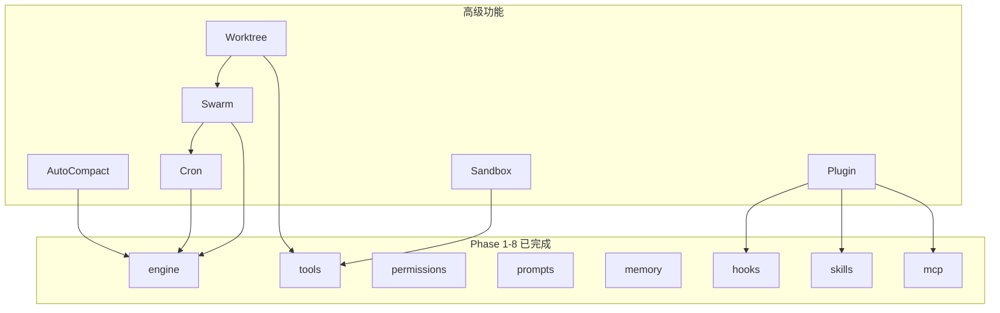

# Rhythm 后端高级功能规划

> 本文档是 `refactor_plan.md` 的续篇，规划 Phase 1-8 完成后的进阶模块。
> 前置条件：`refactor_plan.md` 中所有 8 个 Phase 已完成实施。
> 参考基础：OpenHarness 全部架构文档。

---

## 目录

- [Phase 9 — Token 自动压缩（AutoCompact）](#phase-9--token-自动压缩autocompact)
- [Phase 10 — 插件系统（Plugin）](#phase-10--插件系统plugin)
- [Phase 11 — Cron 任务调度](#phase-11--cron-任务调度)
- [Phase 12 — 多 Agent 协调（Coordinator/Swarm）](#phase-12--多-agent-协调coordinatorswarm)
- [Phase 13 — Git Worktree 隔离](#phase-13--git-worktree-隔离)
- [Phase 14 — 沙箱（Sandbox）执行](#phase-14--沙箱sandbox-执行)
- [模块依赖关系](#模块依赖关系)
- [目录结构扩展](#目录结构扩展)

---

## Phase 9 — Token 自动压缩（AutoCompact）

### 背景

长对话会导致消息历史中的 token 数量超出 LLM 上下文窗口限制，从而导致循环中止或响应质量下降。  
OpenHarness 设计了两级压缩策略：微压缩（低代价）+ 完整 LLM 摘要压缩（高代价）。

### 目录

```
src-tauri/src/
└── engine/
    └── compactor.rs        # ★ 新建：AutoCompact 策略实现
```

### 核心设计

#### 压缩状态追踪

```rust
// engine/compactor.rs

pub struct AutoCompactState {
    /// 上次完整压缩后的消息数量，避免重复压缩
    last_compact_at: Option<usize>,
    /// 累计微压缩次数（超过阈值才触发完整压缩）
    micro_compact_count: usize,
}

pub struct CompactResult {
    pub messages: Vec<ChatMessage>,
    pub was_compacted: bool,
    pub compact_type: CompactType,     // Micro | Full
    pub tokens_saved: Option<usize>,
}

pub enum CompactType {
    /// 微压缩：清除旧 ToolResult 内容（保留结构，清空 output 字段）
    Micro,
    /// 完整压缩：调用 LLM 总结历史，替换为摘要消息
    Full,
}
```

#### 两级压缩触发逻辑

```rust
pub async fn auto_compact_if_needed(
    messages: Vec<ChatMessage>,
    api_client: &dyn LlmClient,
    model: &str,
    system_prompt: &str,
    state: &mut AutoCompactState,
    token_limit: usize,         // 通常为 max_tokens * 0.8（80% 触发阈值）
) -> CompactResult {

    let estimated_tokens = estimate_token_count(&messages);

    if estimated_tokens < token_limit {
        return CompactResult { was_compacted: false, .. };
    }

    // 先尝试微压缩（代价低）
    if state.micro_compact_count < 3 {
        let compacted = micro_compact(messages);
        let after_tokens = estimate_token_count(&compacted);

        if after_tokens < token_limit {
            state.micro_compact_count += 1;
            return CompactResult {
                messages: compacted,
                was_compacted: true,
                compact_type: CompactType::Micro,
                ..
            };
        }
    }

    // 微压缩不足，触发完整 LLM 摘要压缩
    let summary = full_compact(messages.clone(), api_client, model, system_prompt).await;
    state.micro_compact_count = 0;
    state.last_compact_at = Some(messages.len());

    CompactResult {
        messages: summary,
        was_compacted: true,
        compact_type: CompactType::Full,
        ..
    }
}
```

#### 微压缩策略

```rust
// 清除早期消息中 ToolResult 的内容，保留结构（保证 LLM 仍能理解对话流程）
fn micro_compact(messages: Vec<ChatMessage>) -> Vec<ChatMessage> {
    let keep_recent = messages.len().saturating_sub(20); // 保留最近 20 条完整
    messages.into_iter().enumerate().map(|(i, msg)| {
        if i < keep_recent {
            strip_tool_result_content(msg)   // 清空 ToolResult output，保留 id/name
        } else {
            msg
        }
    }).collect()
}
```

#### 完整摘要压缩策略

```rust
// 调用 LLM 将历史对话总结为结构化摘要，替换为单条 system 消息
async fn full_compact(
    messages: Vec<ChatMessage>,
    api_client: &dyn LlmClient,
    model: &str,
    original_system_prompt: &str,
) -> Vec<ChatMessage> {
    let summary_prompt = format!(
        "Summarize the following conversation history concisely. \
         Preserve: key decisions made, files modified, current task state, \
         and any pending work. Output in structured markdown.\n\n{}",
        format_messages_as_text(&messages)
    );

    let summary = api_client.complete(summary_prompt, model).await
        .unwrap_or_else(|_| "（历史摘要不可用）".into());

    vec![
        ChatMessage {
            role: "system".into(),
            content: format!("{}\n\n# 历史会话摘要\n\n{}", original_system_prompt, summary),
        }
    ]
}
```

#### Token 估算

```rust
// 简单估算：字符数 / 4（英文约 4 字符/token，中文约 2 字符/token）
// 后期可集成 tiktoken-rs 精确计算
fn estimate_token_count(messages: &[ChatMessage]) -> usize {
    messages.iter().map(|m| m.content_text().len() / 3).sum()
}
```

### 集成到 engine/agent_loop.rs

```rust
// 在每轮 LLM 调用前检查是否需要压缩
let result = auto_compact_if_needed(
    messages,
    &context.api_client,
    &context.model,
    &context.system_prompt,
    &mut compact_state,
    context.max_tokens as usize * 4 / 5,  // 80% 触发阈值
).await;

if result.was_compacted {
    event_bus::emit(agent_id, session_id, EventPayload::ContextCompacted {
        compact_type: result.compact_type.to_string(),
        tokens_saved: result.tokens_saved,
    });
}
```

### 新增 StreamEvent

```rust
ContextCompacted { compact_type: String, tokens_saved: Option<usize> },
```

### 配置项扩展

```json
{
  "auto_compact": {
    "enabled": true,
    "threshold_ratio": 0.8,       // max_tokens 的 80% 触发
    "max_micro_compacts": 3       // 微压缩最大次数后触发完整压缩
  }
}
```

---

## Phase 10 — 插件系统（Plugin）

### 背景

插件系统是 Skills、Hooks、MCP 三个模块的统一扩展入口，允许开发者通过目录结构分发可复用功能包。  
**前置条件**：Phase 5（Skills）、Phase 7（Hooks）、Phase 8（MCP）均已完成。

### 目录

```
src-tauri/src/
└── plugins/
    ├── mod.rs
    ├── types.rs        # PluginManifest + LoadedPlugin
    ├── loader.rs       # 发现与加载逻辑
    └── installer.rs    # 安装/卸载工具
```

### 插件目录约定

```
~/.rhythm/plugins/              # 用户级插件
└── my-plugin/
    ├── plugin.json             # 插件清单（必需）
    ├── skills/
    │   └── my-skill.md
    ├── hooks.json              # Hook 配置
    └── mcp.json                # MCP 服务器配置

<project>/.rhythm/plugins/      # 项目级插件（优先级更高）
```

### 核心数据类型

```rust
// types.rs

/// 插件清单（plugin.json）
pub struct PluginManifest {
    pub name: String,
    pub version: String,
    pub description: String,
    pub enabled_by_default: bool,
    pub skills_dir: String,         // 默认 "skills"
    pub hooks_file: String,         // 默认 "hooks.json"
    pub mcp_file: String,           // 默认 "mcp.json"
}

/// 加载到内存的插件运行时表示
pub struct LoadedPlugin {
    pub manifest: PluginManifest,
    pub path: PathBuf,
    pub enabled: bool,
    pub skills: Vec<SkillDefinition>,
    pub hooks: HashMap<String, Vec<HookDefinition>>,  // event → hooks
    pub mcp_servers: HashMap<String, McpServerConfig>,
}
```

### 加载机制

```rust
// loader.rs

/// 发现两级插件目录中的所有插件路径
pub fn discover_plugin_paths(cwd: &Path) -> Vec<PathBuf> {
    let user_dir = get_user_plugins_dir();        // ~/.rhythm/plugins/
    let project_dir = get_project_plugins_dir(cwd); // <cwd>/.rhythm/plugins/
    // 扫描两个目录中包含 plugin.json 的子目录
}

/// 加载单个插件
pub fn load_plugin(
    path: &Path,
    enabled_plugins: &HashMap<String, bool>,
) -> Option<LoadedPlugin> {
    // 1. 读取并解析 plugin.json（serde_json）
    // 2. 确定启用状态（enabled_plugins.get(name) 或 manifest.enabled_by_default）
    // 3. 加载 skills/目录中的 *.md 文件
    // 4. 加载 hooks.json
    // 5. 加载 mcp.json
}

/// 加载所有插件
pub fn load_plugins(settings: &RhythmSettings, cwd: &Path) -> Vec<LoadedPlugin>
```

### 安装/卸载

```rust
// installer.rs

/// 将插件目录复制到 ~/.rhythm/plugins/
pub fn install_plugin(source: &Path) -> Result<PathBuf, RhythmError>

/// 删除 ~/.rhythm/plugins/<name>
pub fn uninstall_plugin(name: &str) -> Result<bool, RhythmError>
```

### 集成点

插件加载后，向三个子系统注入贡献：

```
load_plugins()
    ↓
SkillRegistry::register(plugin.skills)      → Phase 5 Skills
HookRegistry::register(plugin.hooks)        → Phase 7 Hooks
McpClientManager::add_configs(plugin.mcp)   → Phase 8 MCP
```

### 新增 Tauri 命令

```rust
// commands/plugins.rs
#[tauri::command] list_plugins(cwd: String) -> Vec<PluginSummary>
#[tauri::command] enable_plugin(name: String) -> Result<()>
#[tauri::command] disable_plugin(name: String) -> Result<()>
#[tauri::command] install_plugin(source_path: String) -> Result<PluginSummary>
#[tauri::command] uninstall_plugin(name: String) -> Result<()>
```

### 配置项扩展

```json
{
  "enabled_plugins": {
    "my-plugin": true,
    "another-plugin": false
  }
}
```

---

## Phase 11 — Cron 任务调度

### 背景

允许用户设定定时任务，在指定时间自动触发 Agent 执行（如：每天早上生成项目日报、每小时检查 Git 状态）。

### 目录

```
src-tauri/src/
└── cron/
    ├── mod.rs
    ├── types.rs        # CronJob + CronStatus
    ├── scheduler.rs    # CronScheduler：调度器主循环
    ├── registry.rs     # CronRegistry：持久化 JSON 注册表
    └── runner.rs       # 任务触发执行器
```

### 核心数据类型

```rust
// types.rs

pub struct CronJob {
    pub id: String,                  // 唯一 ID（uuid v4 前 8 位）
    pub name: String,
    pub schedule: String,            // Cron 表达式（5字段：分 时 日 月 周）
    pub command: Option<String>,     // Shell 命令（与 prompt 二选一）
    pub prompt: Option<String>,      // Agent 提示词（与 command 二选一）
    pub cwd: String,
    pub enabled: bool,
    pub created_at: f64,
    pub last_run: Option<f64>,
    pub next_run: Option<f64>,       // 预计下次运行时间（缓存）
    pub last_status: Option<CronRunStatus>,
}

pub enum CronRunStatus {
    Success,
    Failed { exit_code: i32, output: String },
    Running,
}
```

### 调度器

```rust
// scheduler.rs

pub struct CronScheduler {
    registry: Arc<Mutex<CronRegistry>>,
    runner: Arc<CronRunner>,
}

impl CronScheduler {
    pub fn start(&self) -> tokio::task::JoinHandle<()> {
        tokio::spawn(async move {
            loop {
                let now = SystemTime::now();
                let due_jobs = self.registry.get_due_jobs(now);

                for job in due_jobs {
                    let runner = self.runner.clone();
                    tokio::spawn(async move {
                        runner.run(&job).await;
                    });
                }

                // 每分钟检查一次（与 cron 最小粒度一致）
                tokio::time::sleep(Duration::from_secs(60)).await;
            }
        })
    }
}
```

### Cron 表达式解析

使用 `cron` crate（`cargo add cron`）解析标准 5 字段 cron 表达式：

```rust
// 验证 cron 表达式
fn validate_cron_expr(expr: &str) -> Result<(), String> {
    cron::Schedule::from_str(expr)
        .map(|_| ())
        .map_err(|e| format!("无效的 cron 表达式: {}", e))
}

// 计算下次运行时间
fn next_run_time(expr: &str) -> Option<DateTime<Utc>> {
    let schedule = cron::Schedule::from_str(expr).ok()?;
    schedule.upcoming(Utc).next()
}
```

### 持久化注册表

```
~/.rhythm/data/cron_jobs.json    # Cron 任务持久化文件
```

```rust
// registry.rs

pub struct CronRegistry {
    jobs: HashMap<String, CronJob>,
    registry_path: PathBuf,         // ~/.rhythm/data/cron_jobs.json
}

impl CronRegistry {
    pub fn load() -> Self            // 从 JSON 文件加载
    pub fn save(&self)               // 持久化到 JSON 文件
    pub fn create(&mut self, job: CronJob) -> &CronJob
    pub fn delete(&mut self, id: &str) -> bool
    pub fn toggle(&mut self, id: &str, enabled: bool)
    pub fn list(&self) -> Vec<&CronJob>
    pub fn get_due_jobs(&self, now: SystemTime) -> Vec<CronJob>
}
```

### 新增 Tauri 命令

```rust
// commands/cron.rs
#[tauri::command] cron_list() -> Vec<CronJob>
#[tauri::command] cron_create(name, schedule, command_or_prompt, cwd) -> CronJob
#[tauri::command] cron_delete(id: String) -> bool
#[tauri::command] cron_toggle(id: String, enabled: bool) -> CronJob
#[tauri::command] cron_trigger(id: String)   // 立即触发一次（忽略调度时间）
```

### 集成到 lib.rs

```rust
// 在 Tauri 启动时启动调度器
let scheduler = CronScheduler::new();
let _handle = scheduler.start();   // tokio task，后台运行
```

---

## Phase 12 — 多 Agent 协调（Coordinator/Swarm）

### 背景

允许一个 Leader Agent 分解任务并派生多个 Worker Agent 并行执行，实现多 Agent 协作。  
**前置条件**：Phase 11（Cron/Tasks 基础设施）为 Agent 子进程管理提供参考。

### 目录

```
src-tauri/src/
├── coordinator/
│   ├── mod.rs
│   ├── agent_definition.rs   # AgentDefinition：Agent 类型描述
│   └── coordinator_mode.rs   # Coordinator 模式检测 + TeamRegistry
│
└── swarm/
    ├── mod.rs
    ├── types.rs              # TeammateSpawnConfig + SpawnResult + 消息类型
    ├── registry.rs           # BackendRegistry：后端检测与选择
    ├── subprocess_backend.rs # SubprocessBackend：子进程执行后端
    ├── in_process.rs         # InProcessBackend：进程内 tokio task 执行
    ├── mailbox.rs            # TeammateMailbox：文件系统邮箱（Agent 间通信）
    ├── permission_sync.rs    # 权限同步协议（Worker → Leader 审批）
    └── team_lifecycle.rs     # TeamFile 持久化 + TeamLifecycleManager
```

### 核心角色模型

| 角色 | 说明 | 标识 |
|------|------|------|
| **Leader** | 任务分解、结果汇总、权限审批 | 无 `RHYTHM_AGENT_ID` 或为 `"team-lead"` |
| **Worker** | 执行具体子任务 | `RHYTHM_AGENT_ID` + `RHYTHM_TEAM_NAME` |

### Agent 定义

```rust
// coordinator/agent_definition.rs

pub struct AgentDefinition {
    // 标识
    pub name: String,                           // 如 "worker", "explorer"
    pub description: String,

    // 能力限制
    pub tools: Option<Vec<String>>,             // None = 所有工具
    pub disallowed_tools: Option<Vec<String>>,
    pub model: Option<String>,                  // 覆盖默认模型
    pub permission_mode: Option<PermissionMode>,
    pub max_turns: Option<usize>,

    // 生命周期
    pub background: bool,

    // 元数据
    pub color: Option<String>,                  // UI 显示颜色
    pub subagent_type: String,                  // 路由键，默认 "general-purpose"
}

/// 内置 Agent 类型
pub fn builtin_agents() -> Vec<AgentDefinition> {
    vec![
        AgentDefinition { name: "general-purpose", .. },
        AgentDefinition { name: "explorer",   model: Some("claude-haiku"), .. },  // 只读探索
        AgentDefinition { name: "worker",     .. },                                // 编码实现
        AgentDefinition { name: "verifier",   .. },                                // 验证检查
    ]
}
```

### Swarm 消息类型

```rust
// swarm/types.rs

pub struct TeammateSpawnConfig {
    pub name: String,
    pub team: String,
    pub prompt: String,
    pub cwd: String,
    pub parent_session_id: String,
    pub model: Option<String>,
    pub permissions: Vec<String>,
    pub session_id: Option<String>,
}

pub struct SpawnResult {
    pub task_id: String,
    pub agent_id: String,       // 格式：{name}@{team}
    pub backend_type: BackendType,
}

pub enum BackendType {
    Subprocess,     // 新开子进程
    InProcess,      // 同进程 tokio task
}

pub struct TeammateMessage {
    pub text: String,
    pub from_agent: String,
}
```

### 执行后端

#### SubprocessBackend（默认）

```rust
// swarm/subprocess_backend.rs

pub struct SubprocessBackend {
    agent_tasks: HashMap<String, String>,   // agent_id → task_id
}

impl SubprocessBackend {
    pub async fn spawn(&mut self, config: TeammateSpawnConfig) -> SpawnResult {
        // 1. 生成 agent_id = "{name}@{team}"
        // 2. 构建子进程命令（rhythm --headless --agent-id {agent_id} --team {team}）
        // 3. 通过 tokio::process::Command 启动子进程
        // 4. 通过 stdin 发送初始 prompt
        // 5. 注册进程到任务管理器
    }

    pub async fn send_message(&self, agent_id: &str, msg: TeammateMessage) {
        // 向子进程 stdin 写入消息
    }

    pub async fn shutdown(&self, agent_id: &str, force: bool) {
        // SIGTERM（优雅）或 SIGKILL（强制）
    }
}
```

#### InProcessBackend（进程内）

```rust
// swarm/in_process.rs

pub struct InProcessBackend {
    active: HashMap<String, TeammateEntry>,  // agent_id → JoinHandle
}

impl InProcessBackend {
    pub async fn spawn(&mut self, config: TeammateSpawnConfig) -> SpawnResult {
        // tokio::spawn(run_agent_task(config))
        // 使用 channel 进行消息传递（替代 stdin/stdout）
    }
}
```

### 文件系统邮箱（Agent 间通信）

```rust
// swarm/mailbox.rs

// 邮箱路径：~/.rhythm/data/teams/{team}/agents/{agent_id}/inbox/

pub struct TeammateMailbox {
    inbox_dir: PathBuf,
}

pub enum MessageType {
    UserMessage,
    PermissionRequest,
    PermissionResponse,
    Shutdown,
    IdleNotification,
}

pub struct MailboxMessage {
    pub id: String,
    pub message_type: MessageType,
    pub sender: String,
    pub payload: serde_json::Value,
    pub timestamp: f64,
}

impl TeammateMailbox {
    pub async fn write(&self, msg: MailboxMessage) {
        // 原子写入：先写 .tmp，再 rename（OS 原子操作）
    }
    pub async fn read_all(&self, unread_only: bool) -> Vec<MailboxMessage>
    pub async fn mark_read(&self, message_id: &str)
}
```

### 权限同步协议

```
Worker 需要写操作权限
    │
    ├─► 向 Leader 邮箱发送 PermissionRequest
    │       { tool_name, tool_input, worker_id }
    │
Leader 检查请求
    │
    ├─► allowed → 向 Worker 邮箱回复 PermissionResponse { approved: true }
    └─► denied  → 向 Worker 邮箱回复 PermissionResponse { approved: false, reason }
    │
Worker 收到响应后继续或中止工具执行
```

### 团队持久化

```
~/.rhythm/data/teams/{team-name}/
├── team.json                       # 团队元数据（成员列表、允许路径规则）
├── permissions/
│   ├── pending/                    # 待审批权限请求
│   └── resolved/                   # 已处理权限请求
└── agents/
    └── {agent_id}/
        └── inbox/                  # Agent 邮箱
            └── {timestamp}_{id}.json
```

### 新增工具（供 Leader 使用）

```rust
// tools/agent_tool.rs          → 派生 Worker Agent 子任务
// tools/send_message_tool.rs   → 向运行中的 Worker 发送消息
// tools/task_stop_tool.rs      → 停止 Worker
```

### 新增 Tauri 命令

```rust
// commands/swarm.rs
#[tauri::command] list_teams() -> Vec<TeamSummary>
#[tauri::command] list_team_agents(team: String) -> Vec<AgentSummary>
#[tauri::command] approve_worker_permission(request_id: String, approved: bool)
```

### 任务通知格式（Worker → Leader）

```
<task-notification>
  <task-id>{agent_id}</task-id>
  <status>completed|failed|killed</status>
  <summary>{人类可读摘要}</summary>
  <result>{最终文本输出}</result>
  <usage>
    <total_tokens>N</total_tokens>
    <tool_uses>N</tool_uses>
    <duration_ms>N</duration_ms>
  </usage>
</task-notification>
```

---

## Phase 13 — Git Worktree 隔离

### 背景

当多个 Agent 并行处理同一仓库的不同任务时，共享工作目录会导致文件冲突。  
Git Worktree 可为每个 Agent 创建独立的工作空间，实现真正的并行隔离。  
**前置条件**：Phase 12（多 Agent 协调）提供 Worktree 的使用场景。

### 目录

```
src-tauri/src/
└── tools/
    ├── enter_worktree.rs   # ★ 新建：创建并进入 Git Worktree
    └── exit_worktree.rs    # ★ 新建：移除 Git Worktree
```

### EnterWorktreeTool

```rust
// tools/enter_worktree.rs

pub struct EnterWorktreeInput {
    pub branch: String,                 // 工作树使用的分支名
    pub path: Option<String>,           // 自定义路径（默认：.rhythm/worktrees/{branch-slug}/）
    pub create_branch: bool,            // 是否创建新分支（默认 true）
    pub base_ref: Option<String>,       // 新分支的基准引用（默认 HEAD）
}

// 执行逻辑：
// 1. 将 branch 名转为 slug（非字母数字替换为 -）
// 2. 确定 worktree 路径：<cwd>/.rhythm/worktrees/<branch-slug>/
// 3. 执行 git worktree add [--branch {branch}] {path} [{base_ref}]
// 4. 返回 worktree 的绝对路径（供后续工具以此为 cwd）

// 输出示例：
// Created worktree at /path/to/project/.rhythm/worktrees/feature-auth/
// Branch: feature/auth
// Base: HEAD (abc1234)
```

### ExitWorktreeTool

```rust
// tools/exit_worktree.rs

pub struct ExitWorktreeInput {
    pub path: String,   // worktree 路径（绝对或相对）
    pub force: bool,    // 是否强制移除（即使有未提交变更，默认 false）
}

// 执行逻辑：
// 1. 解析为绝对路径
// 2. 执行 git worktree remove [--force] {path}
// 3. 清理 .rhythm/worktrees/ 中的残留目录

// 安全检查：
// - 禁止移除主工作树（cwd 本身）
// - 未提交变更时 force=false → 返回错误提示
```

### 与 Swarm 集成

```rust
// swarm/types.rs 扩展
pub struct TeammateSpawnConfig {
    // ...现有字段
    pub worktree_path: Option<String>,  // 若设置，Worker 在此 worktree 路径执行
}
```

Worker Agent 启动时：
1. Leader 调用 `enter_worktree` 工具创建隔离环境
2. `TeammateSpawnConfig::worktree_path` 传递 worktree 路径
3. Worker 在该路径下执行所有操作
4. Worker 完成后，Leader 调用 `exit_worktree` 清理

### 清理机制

```rust
// swarm/team_lifecycle.rs 扩展

pub async fn cleanup_team_worktrees(team_name: &str) -> Result<()> {
    // 1. 扫描 ~/.rhythm/data/teams/{team}/team.json 中记录的 worktree 路径
    // 2. git worktree remove --force {path}
    // 3. 删除残留目录
}
```

---

## Phase 14 — 沙箱（Sandbox）执行

### 背景

在不受信任的代码执行场景下（如执行用户提供的代码），需要限制进程对文件系统和网络的访问，防止越权操作。  
**重要**：Windows 平台沙箱支持有限，需要分平台实现。

### 目录

```
src-tauri/src/
└── sandbox/
    ├── mod.rs
    ├── types.rs            # SandboxConfig + SandboxPolicy
    ├── checker.rs          # SandboxChecker：执行前校验
    └── platform/
        ├── mod.rs
        ├── linux.rs        # Linux：基于 seccomp/namespaces
        ├── macos.rs        # macOS：基于 sandbox-exec
        └── windows.rs      # Windows：基于 Job Objects（有限支持）
```

### 核心数据类型

```rust
// types.rs

pub struct SandboxConfig {
    pub enabled: bool,
    pub fail_if_unavailable: bool,      // 沙箱不可用时是否拒绝执行
    pub network: SandboxNetworkPolicy,
    pub filesystem: SandboxFsPolicy,
}

pub struct SandboxNetworkPolicy {
    pub allowed_domains: Vec<String>,   // 允许的域名（空 = 允许所有）
    pub denied_domains: Vec<String>,    // 拒绝的域名
    pub allow_local: bool,              // 是否允许 localhost
}

pub struct SandboxFsPolicy {
    pub allow_read: Vec<String>,        // Glob 路径：允许读取
    pub deny_read: Vec<String>,
    pub allow_write: Vec<String>,       // 默认 ["."]（当前目录）
    pub deny_write: Vec<String>,
}
```

### 平台适配层

#### Linux（seccomp + namespaces）

```rust
// sandbox/platform/linux.rs

// 使用 bubblewrap (bwrap) 或 landlock 实现
// bwrap --ro-bind / / --dev /dev --tmpfs /tmp
//       --bind {cwd} {cwd}
//       -- {command}

pub fn build_sandbox_command(
    base_cmd: &str,
    cwd: &Path,
    policy: &SandboxFsPolicy,
) -> std::process::Command {
    let mut cmd = std::process::Command::new("bwrap");
    cmd.args(["--ro-bind", "/", "/"]);
    for allow_write_path in &policy.allow_write {
        cmd.args(["--bind", allow_write_path, allow_write_path]);
    }
    cmd.args(["--", base_cmd]);
    cmd
}
```

#### macOS（sandbox-exec）

```rust
// sandbox/platform/macos.rs

pub fn build_sandbox_profile(policy: &SandboxFsPolicy) -> String {
    // 生成 Apple Sandbox Profile 格式（Scheme-like DSL）
    format!(r#"
(version 1)
(deny default)
(allow file-read* (subpath "/usr/lib"))
(allow file-read-write (subpath "{}"))
    "#, policy.allow_write.join("") )
}
```

#### Windows（Job Objects）

```rust
// sandbox/platform/windows.rs

// Windows 沙箱能力有限，主要通过 Job Objects 限制：
// - CPU/内存配额
// - 子进程数量限制
// 文件系统和网络限制需要额外工具（如 Sandboxie），暂标记为 PartialSupport

pub enum WindowsSandboxSupport {
    Full,                   // Job Object + 额外限制
    PartialResourceLimits,  // 仅 CPU/内存限制
    NotAvailable,           // 完全不支持（如旧 Windows 版本）
}

pub fn detect_sandbox_support() -> WindowsSandboxSupport {
    // 检测 Windows 版本和可用 API
}
```

### SandboxChecker（执行前校验）

```rust
// sandbox/checker.rs

pub struct SandboxChecker {
    config: SandboxConfig,
    platform_available: bool,
}

impl SandboxChecker {
    /// 检查命令是否可以在沙箱中执行
    pub fn check(&self, command: &str, cwd: &Path) -> SandboxDecision {
        if !self.config.enabled {
            return SandboxDecision::Passthrough;
        }
        if !self.platform_available {
            if self.config.fail_if_unavailable {
                return SandboxDecision::Blocked("沙箱不可用".into());
            }
            return SandboxDecision::Passthrough;
        }
        SandboxDecision::Sandboxed(self.build_sandboxed_command(command, cwd))
    }
}

pub enum SandboxDecision {
    Passthrough,                        // 直接执行（沙箱禁用）
    Sandboxed(std::process::Command),   // 包装在沙箱中执行
    Blocked(String),                    // 拒绝执行
}
```

### 集成到 ShellTool

```rust
// tools/shell.rs - 修改
impl ShellTool {
    async fn execute(&self, args: Value, ctx: &ToolExecutionContext) -> ToolResult {
        let command = args["command"].as_str().unwrap_or("");

        // 从 ctx.metadata 获取 sandbox_checker
        if let Some(checker) = ctx.metadata.get("sandbox_checker") {
            match checker.check(command, &ctx.cwd) {
                SandboxDecision::Sandboxed(cmd) => { /* 在沙箱中执行 */ }
                SandboxDecision::Blocked(reason) => {
                    return ToolResult { output: reason, is_error: true };
                }
                SandboxDecision::Passthrough => { /* 正常执行 */ }
            }
        }
        // ... 正常执行逻辑
    }
}
```

### 配置项扩展

```json
{
  "sandbox": {
    "enabled": false,
    "fail_if_unavailable": false,
    "network": {
      "allowed_domains": ["api.anthropic.com", "api.openai.com"],
      "denied_domains": [],
      "allow_local": true
    },
    "filesystem": {
      "allow_read": ["/usr/lib", "/usr/local/lib"],
      "deny_read": ["**/.env", "**/secrets/**"],
      "allow_write": ["."],
      "deny_write": ["**/node_modules/**"]
    }
  }
}
```

---

## 模块依赖关系



---

## 目录结构扩展

在 `refactor_plan.md` 的基础上，新增以下目录：

```
src-tauri/src/
├── engine/
│   └── compactor.rs        # Phase 9
├── plugins/                # Phase 10
│   ├── mod.rs
│   ├── types.rs
│   ├── loader.rs
│   └── installer.rs
├── cron/                   # Phase 11
│   ├── mod.rs
│   ├── types.rs
│   ├── scheduler.rs
│   ├── registry.rs
│   └── runner.rs
├── coordinator/            # Phase 12
│   ├── mod.rs
│   ├── agent_definition.rs
│   └── coordinator_mode.rs
├── swarm/                  # Phase 12
│   ├── mod.rs
│   ├── types.rs
│   ├── registry.rs
│   ├── subprocess_backend.rs
│   ├── in_process.rs
│   ├── mailbox.rs
│   ├── permission_sync.rs
│   └── team_lifecycle.rs
└── sandbox/                # Phase 14
    ├── mod.rs
    ├── types.rs
    ├── checker.rs
    └── platform/
        ├── linux.rs
        ├── macos.rs
        └── windows.rs
```

---

## 实施优先级建议

| Phase | 功能 | 前置依赖 | 推荐时机 |
|-------|------|----------|----------|
| 9 | AutoCompact | Phase 3 引擎重构 | 用户反馈长对话卡死时 |
| 10 | Plugin 系统 | Phase 5+7+8 全部完成 | 生态建设期 |
| 11 | Cron 调度 | 独立 | 用户需要自动化工作流时 |
| 12 | Swarm 多 Agent | Phase 11 完成 | 大型复杂任务场景 |
| 13 | Worktree 隔离 | Phase 12 完成 | 与 Swarm 配套 |
| 14 | 沙箱执行 | Phase 3 完成 | 高安全要求场景，Windows 后实现 |
